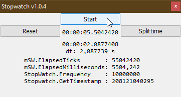

# Sys_StopWatch  
## class System.Diagnostics.Stopwatch using QueryPerformance-API and a Currency  

Project started around dec. 2010.  
This is the Stopwatch class for VB6/VBA and it works the same as the corresponding .net-class from the namespace System.Diagnostics. 
The class uses the QueryPerformanceFrequency/QueryPerformanceCounter winapi-functions together with variables of type Currency.  
The datatype Currency is literally ideal for using it together with the QueryPerformance-Winapi-functions. 
It is a 64-bit datatype with a fixed-point part. The value 1 is defined at the bit &H2710 (decimal = 10000). 
The smallest positive value of the Currency is 0.0001, CPU-time-ticks-per-milliseconds have this in common. 
I first posted this class on ActiveVB, it had a little issue that was solved long ago you may also have a look and compare it:
[VB 5/6-Tipp 0746: QueryPerformance und StopWatch mit Variablentyp Currency](http://www.activevb.de/tipps/vb6tipps/tipp0746.html)

